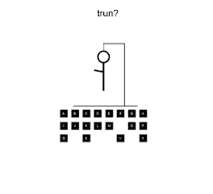

# HangMan (Anime/Cartoon characters)

## Background

-Game Choice: Hangman
    I wanted to choose a game that I thought would challenge me to the best of my abilites, and to add a little twist I chose to do anime and cartoon characters to add a little fun or twist to it.

## WireFrame

### PseudoCode
1. Set Container
    1.1 format container to a box to be able to put my game inside
    1.2 set an outside container to display a message (if possible)
    1.3 display message to start game by clicking a letter
    1.4 display blank lines to show how many letters are in the word
    1.5 set picture to were the hangman is going to appear

2. format
    2.1 everytime a wrong letter is picked display how many lives left till losing
    2.2 display letter if the correct letter is in the word
    2.3 if correct letter is chosen move to area needed
    2.4 if wrong letter is chosen subtract a letter from the lives
    2.5 black out letter if it is wrong
    2.6 be able to click the letters
    2.7 able to choose from bank at random

3. Bank
    3.1 create word bank to hold the words
    3.2 create option to choose between anime and cartoon characters(optional)
    3.3 connect bank to formating so that they can choose word at random from the bank
    